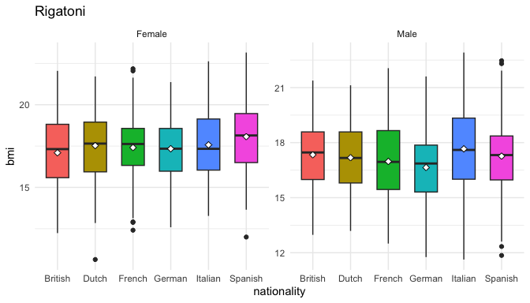

<!-- README.md is generated from README.Rmd. Please edit that file -->

# pastaDaGg 

### Authentic italian `ggplot2` recepies

<!-- badges: start -->

<!-- badges: end -->

A delicious toy wrapper around `ggplot2` for visualizing longitudinal
datasets.

## Installation

You can install the development version of pastaDaGg from
[GitHub](https://github.com/) with:

``` r
# install.packages("pak")
pak::pak("SereDef/pastaDaGg")
# or 
# devtools::install_github("SereDef/pastaDaGg")
```

## Examples

### Spaghetti

``` r
library(pastaDaGg)

spaghetti(anthropometry, id = "id", 
  y = "head_circumference", 
  y_lab = "Head circumference (cm)",
  x_lab = "Age (years)", # x is "age" by default
  color_by = "sex", 
  split_by = "nationality")
```


### Rigatoni

``` r
rigatoni(anthropometry, x = 'nationality', y = 'bmi', split_by='sex')
```


