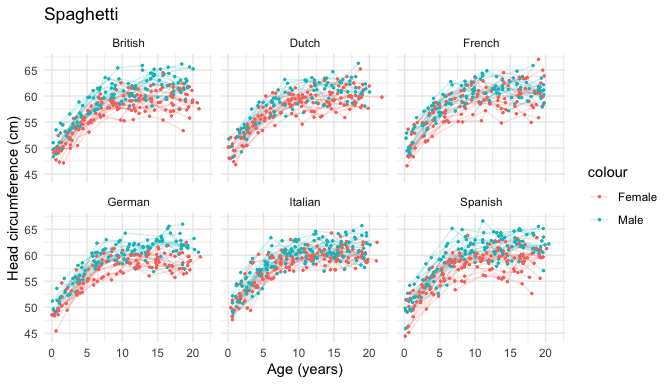

<!-- README.md is generated from README.Rmd. Please edit that file -->

# pastaDaGg 

### Authentic italian `ggplot2` recepies

<!-- badges: start -->

<!-- badges: end -->

A delicious toy wrapper around `ggplot2` for visualizing longitudinal
datasets.

## Installation

You can install the development version of pastaDaGg from
[GitHub](https://github.com/) with:

``` r
# install.packages("pak")
# pak::pak("SereDef/pastaDaGg")
# or 
devtools::install_github("SereDef/pastaDaGg")
#> Using GitHub PAT from the git credential store.
#> Downloading GitHub repo SereDef/pastaDaGg@HEAD
#> 
#> ── R CMD build ─────────────────────────────────────────────────────────────────
#> * checking for file ‘/private/var/folders/f9/fknlq25n23l74zmhg8zbckx80000gn/T/Rtmp7MCVDH/remotescbbd21be29bb/SereDef-pastaDaGg-8fec9a8/DESCRIPTION’ ... OK
#> * preparing ‘pastaDaGg’:
#> * checking DESCRIPTION meta-information ... OK
#> * checking for LF line-endings in source and make files and shell scripts
#> * checking for empty or unneeded directories
#> * building ‘pastaDaGg_0.0.0.9000.tar.gz’
#> Installing package into '/private/var/folders/f9/fknlq25n23l74zmhg8zbckx80000gn/T/RtmpBdEh3u/temp_libpathb0797b4e98c'
#> (as 'lib' is unspecified)
```

## Examples

### Spaghetti

``` r
library(pastaDaGg)

spaghetti(anthropometry, y = "head_circumference", id = "id", color_by = "sex", split_by = "nationality")
```


